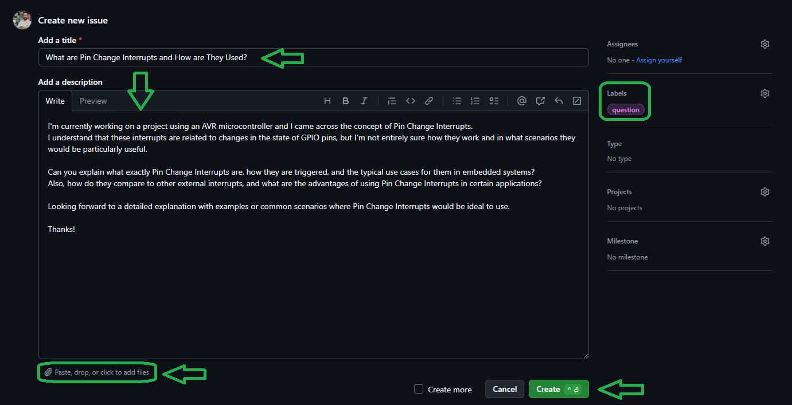

# External Interrupts in ATMEGA328

External interrupts in microcontrollers like the ATMEGA328 are used to trigger an interrupt based on external events such as a button press or a signal change. These interrupts are useful for responding to events asynchronously, which allows the main program to continue running while it waits for an interrupt to occur. The ATMEGA328 has several external interrupt pins (INT0, INT1) that can be configured to trigger interrupts on specific events like a rising edge, falling edge, or any logical change on the input signal.

<table>
  <tr>
  <td valign="top">
  
  > [!TIP]  
  > If you're looking to better understand how to navigate and use my GitHub repositories — including exploring their structure, downloading or cloning projects, submitting issues, and asking questions,  
  > everything you need is clearly explained in this video:  
  > [aKaReZa 95 - Programming, Git - PART B](https://youtu.be/zYiUItVFRqQ)  
  > Make sure to check it out!
  
  </td>
    <td width="360" valign="middle" style="padding: 0;">
      <a href="https://youtu.be/zYiUItVFRqQ">
       
      </a>
    </td>
  </td>
  </tr>

<tr>
  <td valign="top">
  
  > [!IMPORTANT]
  > Begin your embedded systems journey with clarity and purpose. This episode outlines a structured roadmap for mastering microcontrollers, communication protocols, hardware design, and project development.  
  > Learn how to choose your specialization, follow curated playlists, and engage effectively with the community—ideal for learners seeking a scalable, goal-driven path into embedded engineering.  
  > [aKaReZa 124 – Embedded Systems Roadmap](https://youtu.be/3QYfv7A7aMc)  
  > Watch it now to kickstart your journey!
  
  </td>
  <td width="360" valign="middle" style="padding: 0;">
    <a href="https://youtu.be/3QYfv7A7aMc">
      
    </a>
  </td>
</tr>

  
  <tr>
  <td colspan="3">

  > [!CAUTION]
  > It is absolutely critical that you carefully read every single word of this document, line by line, to ensure you don't miss any details. Nothing can be overlooked.
      
  </td>
  </tr>  
</table>

# 🔗 Resources
  Here you'll find a collection of useful links and videos related to the topic of AVR microcontrollers.  


## **External Interrupts Overview**

```
External Interrupts Overview
├── Documentation
│   ├─ [EXT_INT0]
│   │   ├─ Pin — PD2 (INT0)
│   │   ├─ Configuration — EICRA (ISC00, ISC01), EIMSK
│   │   ├─ Trigger Modes — Low level, logical change, falling edge, rising edge
│   │   ├─ Flag — EIFR (INTF0)
│   │   ├─ Clearing Flag — Write 1 to INTF0
│   │   └─ ISR Vector — INT0_vect
│   │
│   ├─ [EXT_INT1]
│   │   ├─ Pin — PD3 (INT1)
│   │   ├─ Configuration — EICRA (ISC10, ISC11), EIMSK
│   │   ├─ Trigger Modes — Low level, logical change, falling edge, rising edge
│   │   ├─ Flag — EIFR (INTF1)
│   │   ├─ Clearing Flag — Write 1 to INTF1
│   │   └─ ISR Vector — INT1_vect
│   │
│   ├─ [PCINT0]
│   │   ├─ Pins — PB0–PB7 (PCINT0–PCINT7)
│   │   ├─ Configuration — PCICR (PCIE0), PCMSK0
│   │   ├─ Trigger — Any logical change
│   │   ├─ Flag — PCIFR (PCIF0)
│   │   ├─ Clearing Flag — Write 1 to PCIF0
│   │   └─ ISR Vector — PCINT0_vect
│   │
│   ├─ [PCINT1]
│   │   ├─ Pins — PC0–PC6 (PCINT8–PCINT14)
│   │   ├─ Configuration — PCICR (PCIE1), PCMSK1
│   │   ├─ Trigger — Any logical change
│   │   ├─ Flag — PCIFR (PCIF1)
│   │   ├─ Clearing Flag — Write 1 to PCIF1
│   │   └─ ISR Vector — PCINT1_vect
│   │
│   └─ [PCINT2]
│       ├─ Pins — PD0–PD7 (PCINT16–PCINT23)
│       ├─ Configuration — PCICR (PCIE2), PCMSK2
│       ├─ Trigger — Any logical change
│       ├─ Flag — PCIFR (PCIF2)
│       ├─ Clearing Flag — Write 1 to PCIF2
│       └─ ISR Vector — PCINT2_vect
│
└── Registers
    ├─ [EICRA]   — External Interrupt Control Register A
    ├─ [EIMSK]   — External Interrupt Mask Register
    ├─ [EIFR]    — External Interrupt Flag Register
    ├─ [PCICR]   — Pin Change Interrupt Control Register
    ├─ [PCMSK0]  — Pin Change Mask Register 0
    ├─ [PCMSK1]  — Pin Change Mask Register 1
    ├─ [PCMSK2]  — Pin Change Mask Register 2
    └─ [PCIFR]   — Pin Change Interrupt Flag Register
```

> [!TIP]
> The resources are detailed in the sections below.  
> To access any of them, simply click on the corresponding blue link.

- [EXT\_INT0.md](./EXT_INT0.md)
  ---
  Covers PD2/INT0 configuration, enabling in EIMSK, selecting trigger mode in EICRA, clearing INTF0 flag, ISR example, and typical use cases.

- [EXT\_INT1.md](./EXT_INT1.md)
  ---
  Covers PD3/INT1 configuration, enabling in EIMSK, selecting trigger mode in EICRA, clearing INTF1 flag, ISR example, and typical use cases.

- [PCINT0.md](./PCINT0.md)
  ---
  Covers PB0–PB7 pin change interrupts, enabling in PCICR/PCMSK0, clearing PCIF0 flag, ISR example, and example detection logic.

- [PCINT1.md](./PCINT1.md)
  ---
  Covers PC0–PC5 pin change interrupts, enabling in PCICR/PCMSK1, clearing PCIF1 flag, ISR example, and typical use cases.

- [PCINT2.md](./PCINT2.md)
  ---
  Covers PD0–PD7 pin change interrupts, enabling in PCICR/PCMSK2, clearing PCIF2 flag, ISR example, and practical applications.

## **Videos Overview**
```plaintext
AVR, External Interrupts
   └── [aKaReZa 55 - AVR, External Interrupts]
       ├─ INT0 & INT1 — Setup and usage in ATMEGA328.
       ├─ Header — eInterrupt.h file introduction.
       ├─ Pin Change INT — Detecting input changes.
       ├─ Flags — Manual clearing techniques.
       └─ Optimization — Code efficiency tips.
```

<table style="border-collapse: collapse;">
  <tr>
    <td valign="top" style="padding: 0 10px;">
      <h3 style="margin: 0;">
        <a href="https://youtu.be/eGV7mYVpWX4">aKaReZa 55 – AVR, External Interrupts</a>
      </h3>
      <p style="margin: 8px 0 0;">
        Learn how to set up and use external interrupts on AVR microcontrollers, specifically focusing on the ATMEGA328. Understand interrupt flags and when to manually clear them.
      </p>
    </td>
    <td width="360" valign="top" style="padding: 0;">
      <a href="https://youtu.be/eGV7mYVpWX4">
        
      </a>
    </td>
  </tr>
</table>

> [!TIP]
> The resources are detailed in the sections below.  
> To access any of them, simply click on the corresponding blue link.

- [AVR Microntroller](https://github.com/aKaReZa75/AVR)
  ---  
    This repository contains comprehensive resources for AVR microcontrollers, including hardware schematics, software libraries, and educational projects.

## Additional Considerations and Common Mistakes

1. **Debouncing Issues**: When using external interrupts triggered by mechanical switches, debounce logic may be necessary to prevent multiple interrupts from being triggered by a single press.
   
   - **Solution**: Use a small delay or software debounce mechanism to ensure clean interrupts.

2. **Interrupt Priority**: ATMEGA328 has fixed interrupt priority, and external interrupts are not the highest priority interrupts. Make sure to handle time-critical tasks in your code accordingly.

3. **Interrupt Flags**: It's essential to clear the interrupt flag (via writing `1` to the flag bit in `EIFR`) in the ISR to ensure that the interrupt can be processed again in the future.

> [!CAUTION]
Always ensure that global interrupts are enabled using the `sei()` function. Without enabling global interrupts, the microcontroller will not respond to any interrupt triggers, including external interrupts or timer interrupts. The `sei()` function sets the Global Interrupt Flag (I-bit) in the Status Register (SREG), which allows interrupt requests to be processed by the microcontroller.

You can use the following macros to enable and disable global interrupts:

- **`globalInt_Enable`**: This macro is equivalent to calling `sei()`. It enables global interrupts, allowing the microcontroller to respond to interrupt requests.

- **`globalInt_Disable`**: This macro is equivalent to calling `cli()`. It disables global interrupts, preventing the microcontroller from processing any interrupts.

By following these steps and considerations, external interrupts can be effectively managed in the ATMEGA328, providing a robust way to handle asynchronous events.


# 💻 How to Use Git and GitHub
To access the repository files and save them on your computer, there are two methods available:
1. **Using Git Bash and Cloning the Repository**
   - This method is more suitable for advanced users and those familiar with command-line tools.
   - By using this method, you can easily receive updates for the repository.

2. **Downloading the Repository as a ZIP file**
   - This method is simpler and suitable for users who are not comfortable with command-line tools.
   - Note that with this method, you will not automatically receive updates for the repository and will need to manually download any new updates.

## Clone using the URL.
First, open **Git Bash** :
-  Open the folder in **File Explorer** where you want the library to be stored.
-  **Right-click** inside the folder and select the option **"Open Git Bash here"** to open **Git Bash** in that directory.


> [!NOTE] 
> If you do not see the "Open Git Bash here" option, it means that Git is not installed on your system.  
> You can download and install Git from [this link](https://git-scm.com/downloads).  
> For a tutorial on how to install and use Git, check out [this video](https://youtu.be/BsykgHpmUt8).
  
-  Once **Git Bash** is open, run the following command to clone the repository:

 ```bash
git clone https://github.com/aKaReZa75/AVR_External_Interrupts.git
```
- You can copy the above command by either:
- Clicking on the **Copy** button on the right of the command.
- Or select the command text manually and press **Ctrl + C** to copy.
- To paste the command into your **Git Bash** terminal, use **Shift + Insert**.


- Then, press Enter to start the cloning operation and wait for the success message to appear.


> [!IMPORTANT]
> Please keep in mind that the numbers displayed in the image might vary when you perform the same actions.  
> This is because repositories are continuously being updated and expanded. Nevertheless, the overall process remains unchanged.

> [!NOTE]
> Advantage of Cloning the Repository:  
> - **Receiving Updates:** By cloning the repository, you can easily and automatically receive new updates.  
> - **Version Control:** Using Git allows you to track changes and revert to previous versions.  
> - **Team Collaboration:** If you are working on a project with a team, you can easily sync changes from team members and collaborate more efficiently.  

## Download Zip
If you prefer not to use Git Bash or the command line, you can download the repository directly from GitHub as a ZIP file.  
Follow these steps:  
1. Navigate to the GitHub repository page and Locate the Code button:
   - On the main page of the repository, you will see a green Code button near the top right corner.

2. Download the repository:
   - Click the Code button to open a dropdown menu.
   - Select Download ZIP from the menu.

    

3. Save the ZIP file:
   - Choose a location on your computer to save the ZIP file and click Save.

4. Extract the ZIP file:
   - Navigate to the folder where you saved the ZIP file.
   - Right-click on the ZIP file and select Extract All... (Windows) or use your preferred extraction tool.
   - Choose a destination folder and extract the contents.

5. Access the repository:
   - Once extracted, you can access the repository files in the destination folder.

> [!IMPORTANT]
> - No Updates: Keep in mind that downloading the repository as a ZIP file does not allow you to receive updates.    
>   If the repository is updated, you will need to download it again manually.  
> - Ease of Use: This method is simpler and suitable for users who are not comfortable with Git or command-line tools.

# 📝 How to Ask Questions
If you have any questions or issues, you can raise them through the **"Issues"** section of this repository. Here's how you can do it:  

1. Navigate to the **"Issues"** tab at the top of the repository page.  

  

2. Click on the **"New Issue"** button.  
   
  

3. In the **Title** field, write a short summary of your issue or question.  

4. In the "Description" field, detail your question or issue as thoroughly as possible. You can use text formatting, attach files, and assign the issue to someone if needed. You can also use text formatting (like bullet points or code snippets) for better readability.  

5. Optionally, you can add **labels**, **type**, **projects**, or **milestones** to your issue for better categorization.  

6. Click on the **"Submit new issue"** button to post your question or issue.
   
  

I will review and respond to your issue as soon as possible. Your participation helps improve the repository for everyone!  

> [!TIP]
> - Before creating a new issue, please check the **"Closed"** section to see if your question has already been answered.  
>     
> - Write your question clearly and respectfully to ensure a faster and better response.  
> - While the examples provided above are in English, feel free to ask your questions in **Persian (فارسی)** as well.  
> - There is no difference in how they will be handled!  

> [!NOTE]
> Pages and interfaces may change over time, but the steps to create an issue generally remain the same.

# 🤝 Contributing to the Repository
To contribute to this repository, please follow these steps:
1. **Fork the Repository**  
2. **Clone the Forked Repository**  
3. **Create a New Branch**  
4. **Make Your Changes**  
5. **Commit Your Changes**  
6. **Push Your Changes to Your Forked Repository**  
7. **Submit a Pull Request (PR)**  

> [!NOTE]
> Please ensure your pull request includes a clear description of the changes you’ve made.
> Once submitted, I will review your contribution and provide feedback if necessary.

# 🌟 Support Me
If you found this repository useful:
- Subscribe to my [YouTube Channel](https://www.youtube.com/@aKaReZa75).
- Share this repository with others.
- Give this repository and my other repositories a star.
- Follow my [GitHub account](https://github.com/aKaReZa75).

# 📜 License
This project is licensed under the GPL-3.0 License. This license grants you the freedom to use, modify, and distribute the project as long as you:
- Credit the original authors: Give proper attribution to the original creators.
- Disclose source code: If you distribute a modified version, you must make the source code available under the same GPL license.
- Maintain the same license: When you distribute derivative works, they must be licensed under the GPL-3.0 too.
- Feel free to use it in your projects, but make sure to comply with the terms of this license.
  
# ✉️ Contact Me
Feel free to reach out to me through any of the following platforms:
- 📧 [Email: aKaReZa75@gmail.com](mailto:aKaReZa75@gmail.com)
- 🎥 [YouTube: @aKaReZa75](https://www.youtube.com/@aKaReZa75)
- 💼 [LinkedIn: @akareza75](https://www.linkedin.com/in/akareza75)
